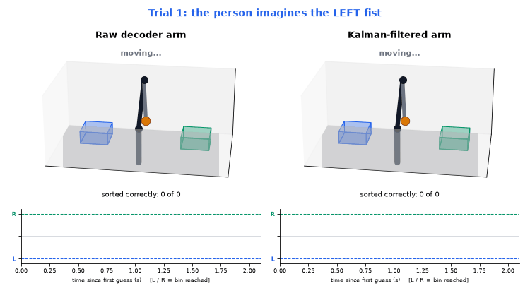
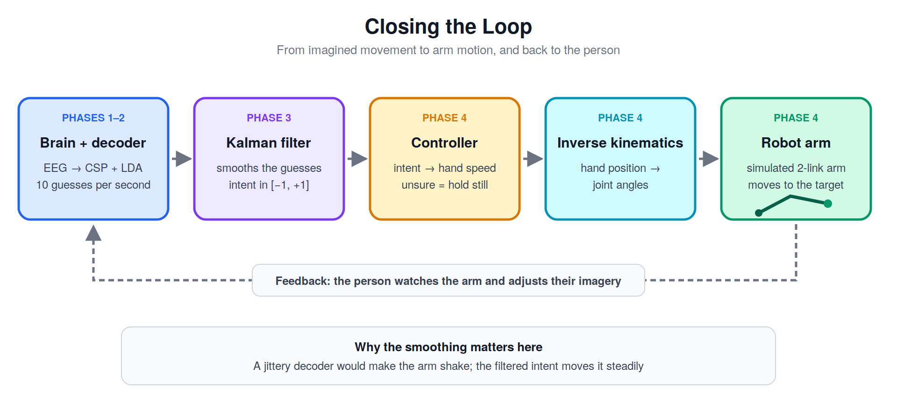
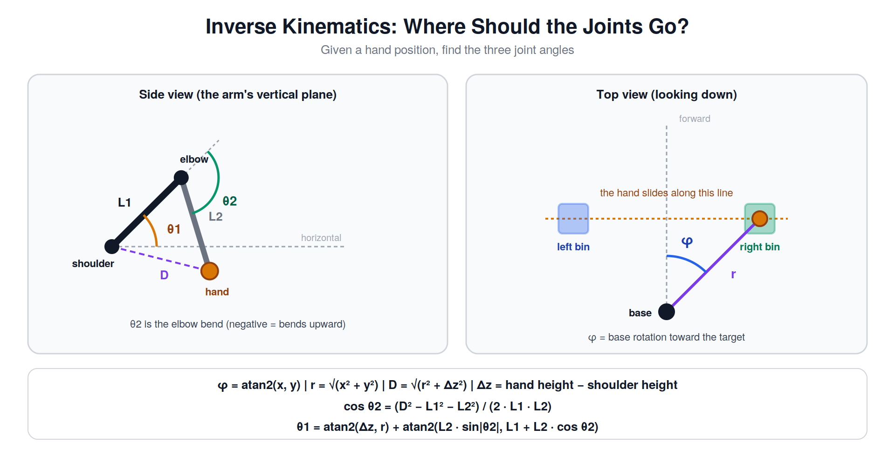
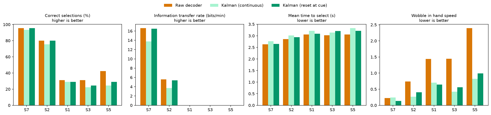
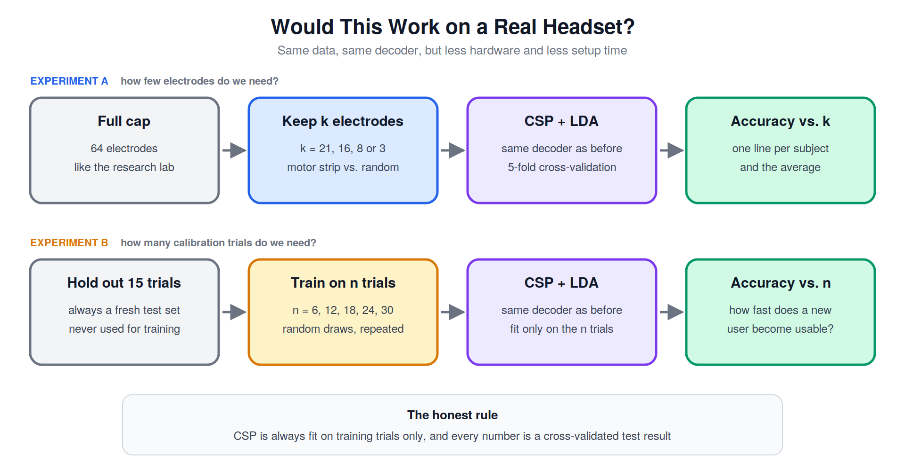
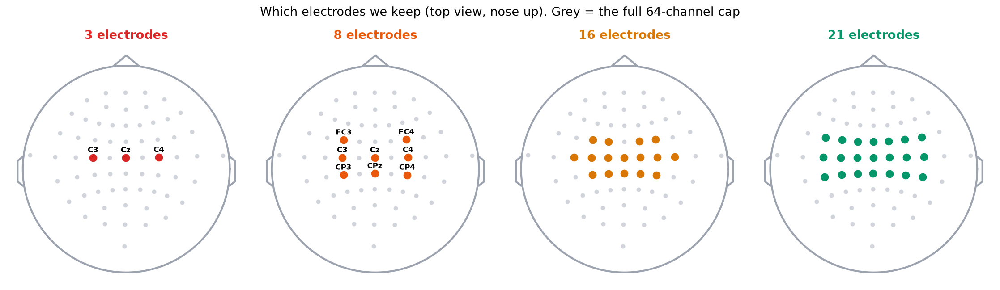
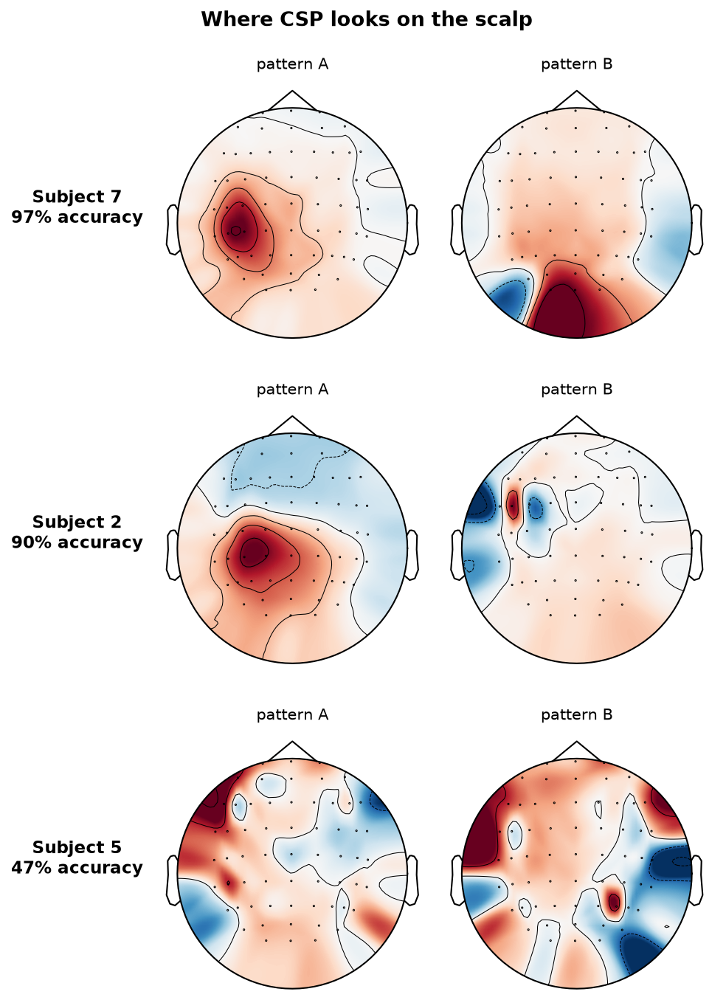
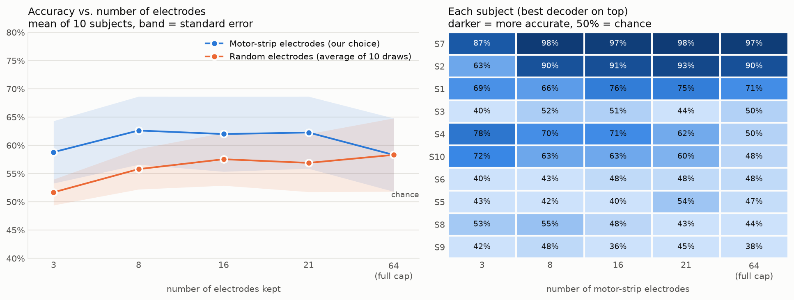
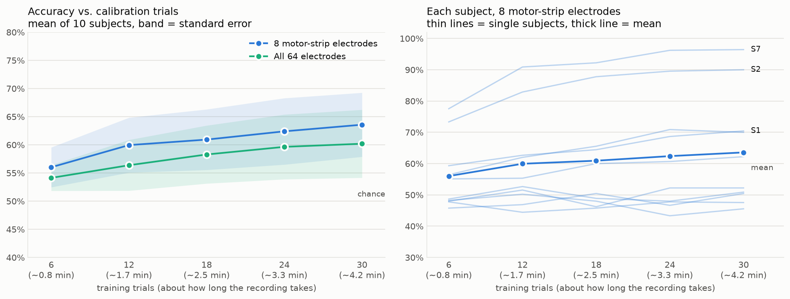

# Brain-Controlled Robotic Arm: EEG-Based Movement Intent Decoding with Kalman-Filtered Robotic Control

An end-to-end pipeline that decodes a person's imagined movement directly from their brain activity (EEG) and uses it to control a simulated robotic arm — the same kind of signal chain underlying real assistive technologies like brain-controlled wheelchairs and prosthetics.

## Overview

A Brain-Computer Interface (BCI) lets a person control a device using brain activity alone, with no physical movement required. This project builds one from the ground up: real EEG data is recorded while a person imagines moving their left or right fist; a machine learning model learns to decode which movement is being imagined from the raw brain signal; and a Kalman filter smooths the model's noisy, real-time predictions into a stable control signal that drives a simulated robotic arm sorting objects into bins. A final phase asks the practical question: could this work with a handful of electrodes and a few minutes of calibration?

The project is built around real, publicly available EEG data rather than synthetic signals, which introduces a genuinely harder and more realistic problem than a clean simulation: brain signals are noisy, vary from person to person, and never produce perfectly separable classes. Working with that messiness honestly, rather than chasing an unrealistically clean result, is part of the point.


## Project Structure

### Phase 1 — EEG Signal Processing & Exploration ✅
`notebooks/01_eeg_preprocessing_exploration.ipynb`

- Loads real motor-imagery EEG (PhysioNet EEG Motor Movement/Imagery Dataset) via MNE-Python.
- Applies an 8–30 Hz bandpass filter and cuts the recording into labeled left-fist / right-fist trials.
- Shows event-related desynchronization (ERD): the mu/beta rhythm weakens over the motor cortex during imagined movement.

### Phase 2 — Movement Intent Classification ✅
`notebooks/02_movement_classification.ipynb`

- Extracts features with Common Spatial Patterns (CSP) and classifies with Linear Discriminant Analysis.
- Evaluates honestly with repeated cross-validation, with CSP fit inside each fold, plus a permutation test.
- Results: **71.8%** for subject 1 (p = 0.03, chance ≈ 51%); **59.7% ± 19.1%** averaged over subjects 1–10, ranging from chance to 98% depending on the person.
- Tests whether covariance shrinkage helps (it doesn't) and reports that honestly.

### Phase 3 — Kalman Filter Smoothing ✅
`notebooks/03_kalman_filter_smoothing.ipynb`

- Turns the decoder into a real-time stream: a sliding 1.5 s window, one guess every 0.1 s, evaluated out-of-sample by splitting on trials.
- Applies a 1-D Kalman filter (the same predict/update structure as the orbital project) to the stream of guesses.
- Across five subjects it cuts output jitter by 19–57% and mid-trial slips by 22–46% with almost no added delay, without changing accuracy. Smoothing steadies a decoder but can't make a chance-level one correct.
- Reports the smoothness vs. speed trade-off by sweeping the process noise Q.


### Phase 4 — Brain-Controlled Sorting Task ✅
`notebooks/04_robotic_arm_control.ipynb`

The filtered intent signal drives a simulated 3-joint robotic arm that **sorts objects into a left or right bin**. The person imagines a left or right fist, and the hand slides toward the matching bin like a joystick: the decoded intent sets the hand's *speed*, and a small deadzone means weak evidence does nothing. When the hand reaches a bin, that counts as a selection.



*Same brain signal, two arms: raw decoder (left) vs. Kalman-filtered (right). First 8 trials of subject 2, shown in order, not hand-picked.*

- **Closed loop:** EEG → decoder → Kalman filter → hand velocity → inverse kinematics → arm.

  
- **Control:** hand velocity = g · deadzone(x̂), with gain g = 1.5 and deadzone d = 0.3, both fixed in advance rather than tuned on results. The hand and the filter reset at every cue.
- **Inverse kinematics:** for a hand target, the base yaw, shoulder and elbow angles are solved in closed form (law of cosines, elbow-up), so the arm follows the hand smoothly.

  
- **Task metrics:** correct / wrong / no selection, time to select, information transfer rate (Wolpaw ITR), and *wobble*, which measures how much the commanded speed jitters beyond its net change.

**Results: five subjects, 45 trials each (decoded out-of-fold)**

| Arm | Correct | Wrong | No selection | Time to select | ITR (bits/min) | Wobble |
|---|---|---|---|---|---|---|
| Raw decoder | 56.0% | 18.2% | 25.8% | 2.93 s | 4.4 | 1.248 |
| Kalman (never reset) | 48.9% | 12.9% | 38.2% | 3.09 s | 3.5 | 0.492 |
| **Kalman (reset at cue)** | 51.6% | 12.4% | 36.0% | 3.02 s | 4.4 | 0.548 |

| Subject | Correct (raw) | Correct (Kalman) | Wobble (raw) | Wobble (Kalman) |
|---|---|---|---|---|
| 7 | 95.6% | 95.6% | 0.223 | 0.137 |
| 2 | 80.0% | 80.0% | 0.738 | 0.406 |
| 1 | 31.1% | 28.9% | 1.442 | 0.644 |
| 3 | 31.1% | 24.4% | 1.442 | 0.559 |
| 5 | 42.2% | 28.9% | 2.397 | 0.993 |



**Takeaways**

- The Kalman filter makes the arm about **56% steadier** and cuts wrong selections from 18.2% to 12.4%. The arm holds still when the evidence is shaky instead of committing.
- The price is fewer correct selections (56.0% → 51.6%) and about 0.1 s more time per selection. With reset at each cue, ITR matches the raw decoder.
- The arm works well for subjects with a decodable signal (subjects 7 and 2) and **not at all for subjects 1, 3 and 5**, whose decoders are near chance. Smoothing cannot create information that isn't in the signal.

### Phase 5 — Would This Work on a Real Headset? ✅
`notebooks/05_headset_practicality.ipynb`

A research cap has 64 electrodes. A real assistive device would have far fewer and almost no setup time. Phase 5 asks **how few electrodes** and **how few calibration trials** the decoder needs, using the same data and decoder as before (CSP + LDA, cross-validated, with CSP re-fit inside every fold), for subjects 1–10.



**Where the decoder looks.** CSP patterns drawn as scalp maps show where on the head the decoded signal lives. For the best subject (7, 97% accuracy), one pattern sits over the left motor cortex, as the neuroscience predicts. The other sits at the back of the head, but a decoder using only motor-strip electrodes matches the full cap, so the motor area carries the decoding.





**Experiment A: how few electrodes?** Nested motor-strip sets (chosen from anatomy before seeing any results) against random electrodes of the same size, mean accuracy over 10 subjects:

| | 3 electrodes | 8 | 16 | 21 | 64 (full cap) |
|---|---|---|---|---|---|
| Motor strip | 58.8% | 62.6% | 62.0% | 62.3% | 58.3% |
| Random electrodes | 51.7% | 55.8% | 57.5% | 56.9% | 58.3% |



**Experiment B: how many calibration trials?** Train on n trials, test on 15 held-out trials, repeated 30 times (about 8 s of recording per trial):

| Training trials (recording time) | 8 motor-strip electrodes | 64 electrodes |
|---|---|---|
| 6 (~0.8 min) | 56.0% | 54.1% |
| 12 (~1.7 min) | 60.0% | 56.4% |
| 18 (~2.5 min) | 60.9% | 58.3% |
| 24 (~3.3 min) | 62.4% | 59.6% |
| 30 (~4.2 min) | 63.6% | 60.2% |



**Takeaways**

- **Where the electrodes sit matters more than how many there are.** The motor strip beats random electrodes at every size, and three random electrodes are at chance.
- **Eight motor-strip electrodes and under two minutes of recording** are enough for the two strongest subjects to reach 80% or more (subjects 7 and 2, at 12 training trials). Three electrodes are too few: they cost these subjects 10 and 27 points.
- **For about half the subjects (3, 5, 6, 8, 9) this decoder never works**, at any electrode count or calibration length. With 45 trials and a simple decoder, we cannot tell whether their signal is absent or the decoder is too weak.

## Limitations

- Everything is simulated and replayed offline from recorded EEG. There is no live closed loop and no physical arm.
- The Kalman noise term R is calibrated using the true labels, and the process noise Q was tuned on subject 7 only.
- ITR ignores the rest periods between trials, so it is an upper bound.
- Decoder quality varies enormously between people: the pipeline works for some subjects and fails for others.
- Phase 5 uses 10 subjects with 45 trials each, so one subject's accuracy carries roughly ±7 points of noise. Differences of a few points, such as 8 electrodes vs. 64, are consistent but not statistically proven.
- Calibration time counts recording only, not headset setup or rest breaks.

## Key Concepts Demonstrated

- EEG signal processing: filtering, epoching, and artifact handling
- Brain-computer interface (BCI) motor-imagery classification
- Kalman filtering for real-time noise reduction and state estimation
- Inverse kinematics, closed-loop control, and information transfer rate (ITR) for a simulated arm
- Practical headset analysis: electrode selection, calibration-time learning curves, and interpretable CSP scalp maps
- Working with real, noisy, human-subject data rather than synthetic/simulated signals

## Data

[PhysioNet EEG Motor Movement/Imagery Dataset](https://physionet.org/content/eegmmidb/1.0.0/) — accessed directly through MNE-Python's built-in dataset loader, no manual download required.

## Setup

```bash
git clone https://github.com/VicDeni/brain-controlled-robotic-arm.git
cd brain-controlled-robotic-arm
python3 -m venv venv
source venv/bin/activate       # or venv\Scripts\activate on Windows
pip install -r requirements.txt
```

Then open any notebook in VS Code or Jupyter and run the cells from top to bottom.

## Status

- ✅ Phase 1 complete
- ✅ Phase 2 complete
- ✅ Phase 3 complete
- ✅ Phase 4 complete
- ✅ Phase 5 complete