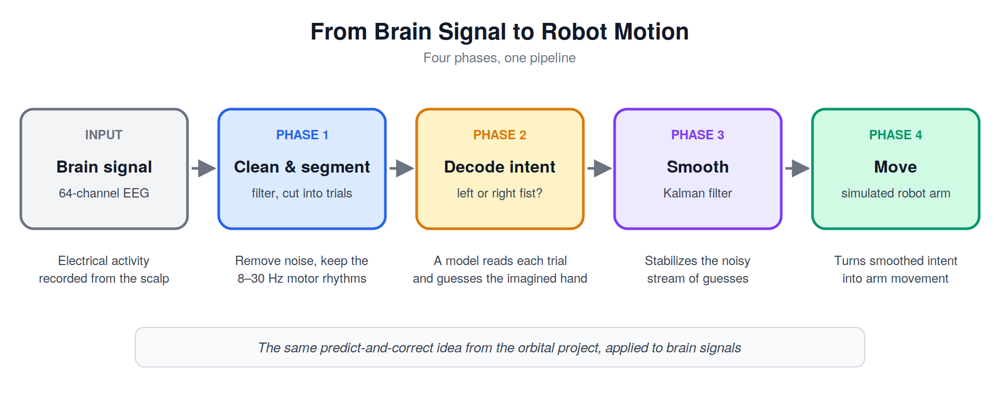

# Brain-Controlled Robotic Arm: EEG-Based Movement Intent Decoding with Kalman-Filtered Robotic Control

An end-to-end pipeline that decodes a person's imagined movement directly from their brain activity (EEG) and uses it to control a simulated robotic arm — the same kind of signal chain underlying real assistive technologies like brain-controlled wheelchairs and prosthetics.

## Overview

A Brain-Computer Interface (BCI) lets a person control a device using brain activity alone, with no physical movement required. This project builds one from the ground up: real EEG data is recorded while a person imagines moving their left hand, right hand, or feet; a machine learning model learns to decode which movement is being imagined from the raw brain signal; and a Kalman filter smooths the model's noisy, real-time predictions into a stable control signal that drives a simulated robotic arm.

The project is built around real, publicly available EEG data rather than synthetic signals, which introduces a genuinely harder and more realistic problem than a clean simulation: brain signals are noisy, vary from person to person, and never produce perfectly separable classes. Working with that messiness honestly, rather than chasing an unrealistically clean result, is part of the point.



## Project Structure

### Phase 1 — EEG Signal Processing & Exploration ✅
`notebooks/01_eeg_preprocessing_exploration.ipynb`

- Loads real motor-imagery EEG (PhysioNet EEG Motor Movement/Imagery Dataset) via MNE-Python.
- Applies an 8–30 Hz bandpass filter and cuts the recording into labeled left-fist / right-fist trials.
- Shows event-related desynchronization (ERD): the mu/beta rhythm weakens over the motor cortex during imagined movement.

### Phase 2 — Movement Intent Classification ✅
`notebooks/02_movement_classification.ipynb`

- Extracts features with Common Spatial Patterns (CSP) and classifies with Linear Discriminant Analysis.
- Evaluates honestly with repeated cross-validation, with CSP fit inside each fold, plus a permutation test.
- Results: **71.8%** for subject 1 (p = 0.03, chance ≈ 51%); **59.7% ± 19.1%** averaged over subjects 1–10, ranging from chance to 98% depending on the person.
- Tests whether covariance shrinkage helps (it doesn't) and reports that honestly.

### Phase 3 — Kalman Filter Smoothing ✅
`notebooks/03_kalman_filter_smoothing.ipynb`

- Turns the decoder into a real-time stream: a sliding 1.5 s window, one guess every 0.1 s, evaluated out-of-sample by splitting on trials.
- Applies a 1-D Kalman filter (the same predict/update structure as the orbital project) to the stream of guesses.
- Across five subjects it cuts output jitter by 19–57% and mid-trial slips by 22–46% with almost no added delay, without changing accuracy. Smoothing steadies a decoder but can't make a chance-level one correct.
- Reports the smoothness vs. speed trade-off by sweeping the process noise Q.


### Phase 4 — Simulated Robotic Arm Control
`notebooks/04_robotic_arm_control.ipynb` *(planned)*

- Builds a simple simulated robotic arm in Python.
- Maps the Kalman-filtered movement intent into actual arm movement commands, closing the loop from raw brain signal to robotic motion.
- Visualizes the full pipeline running end-to-end: EEG in, robot arm movement out.

## Key Concepts Demonstrated

- EEG signal processing: filtering, epoching, and artifact handling
- Brain-computer interface (BCI) motor-imagery classification
- Kalman filtering for real-time noise reduction and state estimation
- Simulated robotic kinematics and control
- Working with real, noisy, human-subject data rather than synthetic/simulated signals

## Data

[PhysioNet EEG Motor Movement/Imagery Dataset](https://physionet.org/content/eegmmidb/1.0.0/) — accessed directly through MNE-Python's built-in dataset loader, no manual download required.

## Setup

```bash
git clone https://github.com/VicDeni/brain-controlled-robotic-arm.git
cd brain-controlled-robotic-arm
python3 -m venv venv
source venv/bin/activate       # or venv\Scripts\activate on Windows
pip install -r requirements.txt
```

Then open any notebook in VS Code or Jupyter and run the cells from top to bottom.

## Status

- ✅ Phase 1 complete
- ✅ Phase 2 complete
- ✅ Phase 3 complete
- 🚧 Phase 4 planned
